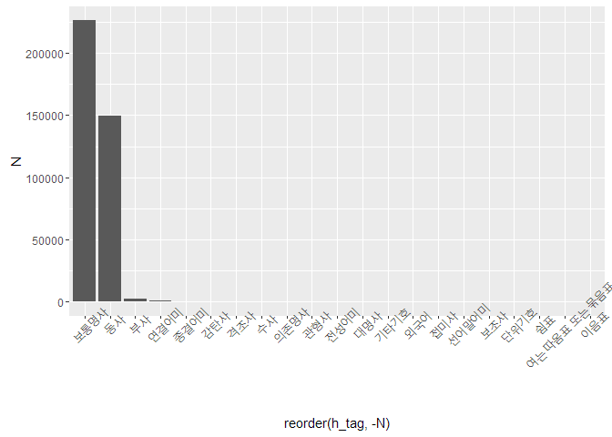

NIA 사전 통계 정보
------------------

### 전체 사전 품사별 단어 통계량

-   중복 단어 제거
-   예) sk 텔레콤, sk텔레콤...

    ##                       h_tag      N      percent
    ##  1:                    동사 149465 3.939354e+01
    ##  2:                보통명사 226290 5.964182e+01
    ##  3:                연결어미    472 1.244020e-01
    ##  4:                종결어미    202 5.323986e-02
    ##  5:              선어말어미     14 3.689891e-03
    ##  6:                전성어미     57 1.502313e-02
    ##  7:                  감탄사    195 5.139491e-02
    ##  8:                  격조사    184 4.849571e-02
    ##  9:                  보조사     13 3.426327e-03
    ## 10:                    부사   2149 5.663983e-01
    ## 11:                  관형사     58 1.528669e-02
    ## 12:                의존명사     78 2.055796e-02
    ## 13:                    수사    118 3.110051e-02
    ## 14:                  대명사     52 1.370531e-02
    ## 15:                  접미사     16 4.217018e-03
    ## 16:                  외국어     24 6.325527e-03
    ## 17:                    쉼표      1 2.635636e-04
    ## 18: 여는 따옴표 또는 묶음표      1 2.635636e-04
    ## 19:                단위기호      1 2.635636e-04
    ## 20:                기타기호     24 6.325527e-03
    ## 21:                  이음표      1 2.635636e-04
    ##                       h_tag      N      percent

<table>
<thead>
<tr class="header">
<th align="left">h_tag</th>
<th align="right">N</th>
<th align="right">percent</th>
</tr>
</thead>
<tbody>
<tr class="odd">
<td align="left">보통명사</td>
<td align="right">226290</td>
<td align="right">59.6418170</td>
</tr>
<tr class="even">
<td align="left">동사</td>
<td align="right">149465</td>
<td align="right">39.3935401</td>
</tr>
<tr class="odd">
<td align="left">부사</td>
<td align="right">2149</td>
<td align="right">0.5663983</td>
</tr>
<tr class="even">
<td align="left">연결어미</td>
<td align="right">472</td>
<td align="right">0.1244020</td>
</tr>
<tr class="odd">
<td align="left">종결어미</td>
<td align="right">202</td>
<td align="right">0.0532399</td>
</tr>
<tr class="even">
<td align="left">감탄사</td>
<td align="right">195</td>
<td align="right">0.0513949</td>
</tr>
<tr class="odd">
<td align="left">격조사</td>
<td align="right">184</td>
<td align="right">0.0484957</td>
</tr>
<tr class="even">
<td align="left">수사</td>
<td align="right">118</td>
<td align="right">0.0311005</td>
</tr>
<tr class="odd">
<td align="left">의존명사</td>
<td align="right">78</td>
<td align="right">0.0205580</td>
</tr>
<tr class="even">
<td align="left">관형사</td>
<td align="right">58</td>
<td align="right">0.0152867</td>
</tr>
<tr class="odd">
<td align="left">전성어미</td>
<td align="right">57</td>
<td align="right">0.0150231</td>
</tr>
<tr class="even">
<td align="left">대명사</td>
<td align="right">52</td>
<td align="right">0.0137053</td>
</tr>
<tr class="odd">
<td align="left">외국어</td>
<td align="right">24</td>
<td align="right">0.0063255</td>
</tr>
<tr class="even">
<td align="left">기타기호</td>
<td align="right">24</td>
<td align="right">0.0063255</td>
</tr>
<tr class="odd">
<td align="left">접미사</td>
<td align="right">16</td>
<td align="right">0.0042170</td>
</tr>
<tr class="even">
<td align="left">선어말어미</td>
<td align="right">14</td>
<td align="right">0.0036899</td>
</tr>
<tr class="odd">
<td align="left">보조사</td>
<td align="right">13</td>
<td align="right">0.0034263</td>
</tr>
<tr class="even">
<td align="left">쉼표</td>
<td align="right">1</td>
<td align="right">0.0002636</td>
</tr>
<tr class="odd">
<td align="left">여는 따옴표 또는 묶음표</td>
<td align="right">1</td>
<td align="right">0.0002636</td>
</tr>
<tr class="even">
<td align="left">단위기호</td>
<td align="right">1</td>
<td align="right">0.0002636</td>
</tr>
<tr class="odd">
<td align="left">이음표</td>
<td align="right">1</td>
<td align="right">0.0002636</td>
</tr>
</tbody>
</table>

각 세그먼트별 통계량
--------------------

### 브랜드명

<table>
<thead>
<tr class="header">
<th align="left">h_tag</th>
<th align="right">cnt</th>
<th align="right">percentage</th>
</tr>
</thead>
<tbody>
<tr class="odd">
<td align="left">보통명사</td>
<td align="right">44562</td>
<td align="right">100</td>
</tr>
</tbody>
</table>

### 일반상품

<table>
<thead>
<tr class="header">
<th align="left">h_tag</th>
<th align="right">cnt</th>
<th align="right">percentage</th>
</tr>
</thead>
<tbody>
<tr class="odd">
<td align="left">보통명사</td>
<td align="right">16548</td>
<td align="right">100</td>
</tr>
</tbody>
</table>

### 인물-이름

<table>
<thead>
<tr class="header">
<th align="left">h_tag</th>
<th align="right">cnt</th>
<th align="right">percentage</th>
</tr>
</thead>
<tbody>
<tr class="odd">
<td align="left">보통명사</td>
<td align="right">63747</td>
<td align="right">100</td>
</tr>
</tbody>
</table>

### 인물,일반

<table>
<thead>
<tr class="header">
<th align="left">h_tag</th>
<th align="right">cnt</th>
<th align="right">percentage</th>
</tr>
</thead>
<tbody>
<tr class="odd">
<td align="left">보통명사</td>
<td align="right">12714</td>
<td align="right">100</td>
</tr>
</tbody>
</table>

### 고유명사

<table>
<thead>
<tr class="header">
<th align="left">h_tag</th>
<th align="right">cnt</th>
<th align="right">percentage</th>
</tr>
</thead>
<tbody>
<tr class="odd">
<td align="left">보통명사</td>
<td align="right">44017</td>
<td align="right">100</td>
</tr>
</tbody>
</table>

### 장소-지명

<table>
<thead>
<tr class="header">
<th align="left">h_tag</th>
<th align="right">cnt</th>
<th align="right">percentage</th>
</tr>
</thead>
<tbody>
<tr class="odd">
<td align="left">보통명사</td>
<td align="right">42821</td>
<td align="right">100</td>
</tr>
</tbody>
</table>

### 장소-일반

<table>
<thead>
<tr class="header">
<th align="left">h_tag</th>
<th align="right">cnt</th>
<th align="right">percentage</th>
</tr>
</thead>
<tbody>
<tr class="odd">
<td align="left">보통명사</td>
<td align="right">777</td>
<td align="right">100</td>
</tr>
</tbody>
</table>

### 동사

<table>
<thead>
<tr class="header">
<th align="left">h_tag</th>
<th align="right">cnt</th>
<th align="right">percentage</th>
</tr>
</thead>
<tbody>
<tr class="odd">
<td align="left">동사</td>
<td align="right">149465</td>
<td align="right">100</td>
</tr>
</tbody>
</table>

### 일반(품사모음)

<table>
<thead>
<tr class="header">
<th align="left">h_tag</th>
<th align="right">cnt</th>
<th align="right">percentage</th>
</tr>
</thead>
<tbody>
<tr class="odd">
<td align="left">부사</td>
<td align="right">2149</td>
<td align="right">45.6069610</td>
</tr>
<tr class="even">
<td align="left">보통명사</td>
<td align="right">1104</td>
<td align="right">23.4295416</td>
</tr>
<tr class="odd">
<td align="left">연결어미</td>
<td align="right">472</td>
<td align="right">10.0169779</td>
</tr>
<tr class="even">
<td align="left">종결어미</td>
<td align="right">202</td>
<td align="right">4.2869270</td>
</tr>
<tr class="odd">
<td align="left">감탄사</td>
<td align="right">195</td>
<td align="right">4.1383701</td>
</tr>
<tr class="even">
<td align="left">격조사</td>
<td align="right">184</td>
<td align="right">3.9049236</td>
</tr>
<tr class="odd">
<td align="left">수사</td>
<td align="right">118</td>
<td align="right">2.5042445</td>
</tr>
<tr class="even">
<td align="left">의존명사</td>
<td align="right">78</td>
<td align="right">1.6553480</td>
</tr>
<tr class="odd">
<td align="left">관형사</td>
<td align="right">58</td>
<td align="right">1.2308998</td>
</tr>
<tr class="even">
<td align="left">전성어미</td>
<td align="right">57</td>
<td align="right">1.2096774</td>
</tr>
<tr class="odd">
<td align="left">대명사</td>
<td align="right">52</td>
<td align="right">1.1035654</td>
</tr>
<tr class="even">
<td align="left">접미사</td>
<td align="right">16</td>
<td align="right">0.3395586</td>
</tr>
<tr class="odd">
<td align="left">선어말어미</td>
<td align="right">14</td>
<td align="right">0.2971138</td>
</tr>
<tr class="even">
<td align="left">보조사</td>
<td align="right">13</td>
<td align="right">0.2758913</td>
</tr>
</tbody>
</table>

### 특수문자

<table>
<thead>
<tr class="header">
<th align="left">h_tag</th>
<th align="right">cnt</th>
<th align="right">percentage</th>
</tr>
</thead>
<tbody>
<tr class="odd">
<td align="left">외국어</td>
<td align="right">24</td>
<td align="right">46.153846</td>
</tr>
<tr class="even">
<td align="left">기타기호</td>
<td align="right">24</td>
<td align="right">46.153846</td>
</tr>
<tr class="odd">
<td align="left">쉼표</td>
<td align="right">1</td>
<td align="right">1.923077</td>
</tr>
<tr class="even">
<td align="left">여는 따옴표 또는 묶음표</td>
<td align="right">1</td>
<td align="right">1.923077</td>
</tr>
<tr class="odd">
<td align="left">단위기호</td>
<td align="right">1</td>
<td align="right">1.923077</td>
</tr>
<tr class="even">
<td align="left">이음표</td>
<td align="right">1</td>
<td align="right">1.923077</td>
</tr>
</tbody>
</table>
