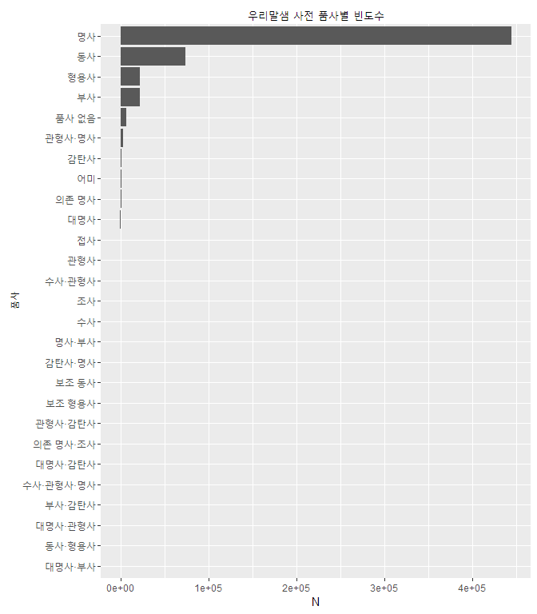
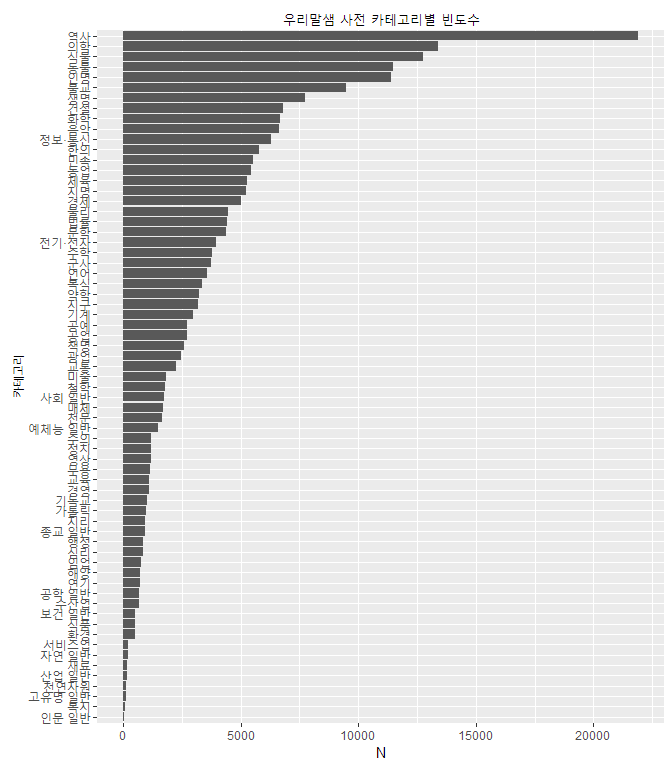

우리말샘 사전
-------------

-   국립국어원에서 제공한 공개사전

<!-- -->

    gogamza@GOGAMZA:/mnt/c/Users/gogamza/Documents/work/NIADic/woorimalsam_161020/utf8$ wc -l *
       60000 OPENDICT_00.txt
       60001 OPENDICT_01.txt
       60001 OPENDICT_02.txt
       60001 OPENDICT_03.txt
       60001 OPENDICT_04.txt
       60001 OPENDICT_05.txt
       60001 OPENDICT_06.txt
       60001 OPENDICT_07.txt
       60001 OPENDICT_08.txt
       60001 OPENDICT_09.txt
       60001 OPENDICT_10.txt
       60001 OPENDICT_11.txt
       60001 OPENDICT_12.txt
       60001 OPENDICT_13.txt
       60001 OPENDICT_14.txt
       60001 OPENDICT_15.txt
       60001 OPENDICT_16.txt
       60001 OPENDICT_17.txt
       33541 OPENDICT_18.txt
     1113558 합계

### 전처리 작업

1.  필요 필드 추출

-   단어, 품사, 카테고리
-   `readxls` 패키지의 오동작으로 인해 엑셀에서 직접 18개 파일의 필드를 추출했음

1.  전처리

-   인코딩 변환 (`euc-kr` -&gt; `utf-8`)
-   일부 옛한글과 특수문자 등 변환이 되지 않는 단어 제거
-   품사정보가 있는 어휘만 선택
-   중복단어 제거 (예, `힝힝대다(동사)` 4개 중복 존재)

1.  품사 -&gt; KAIST TAG 셋 변환
2.  1,113,558 -&gt; 579,518 로 KoNLP에 적용될 건수 줄어들었음

### 품사/카테고리별 통계량

| category    |       N|
|:------------|-------:|
|             |  349802|
| 역사        |   21910|
| 의학        |   13379|
| 식물        |   12765|
| 동물        |   11489|
| 인명        |   11402|
| 불교        |    9481|
| 생명        |    7750|
| 건설        |    6793|
| 화학        |    6688|
| 음악        |    6622|
| 정보·통신   |    6311|
| 한의        |    5771|
| 민속        |    5516|
| 농업        |    5459|
| 체육        |    5294|
| 지명        |    5225|
| 경제        |    5027|
| 물리        |    4479|
| 법률        |    4408|
| 문학        |    4386|
| 전기·전자   |    3945|
| 수학        |    3781|
| 군사        |    3755|
| 언어        |    3590|
| 복식        |    3360|
| 약학        |    3229|
| 지구        |    3188|
| 기계        |    2975|
| 공예        |    2724|
| 공업        |    2703|
| 책명        |    2578|
| 광업        |    2460|
| 교통        |    2258|
| 미술        |    1842|
| 철학        |    1799|
| 사회 일반   |    1763|
| 매체        |    1689|
| 천문        |    1670|
| 예체능 일반 |    1509|
| 수의        |    1197|
| 정치        |    1189|
| 영상        |    1185|
| 무용        |    1138|
| 교육        |    1118|
| 경영        |    1106|
| 기독교      |    1017|
| 가톨릭      |     979|
| 지리        |     935|
| 종교 일반   |     924|
| 행정        |     857|
| 심리        |     855|
| 임업        |     763|
| 해양        |     724|
| 연기        |     721|
| 공학 일반   |     686|
| 수산업      |     664|
| 보건 일반   |     518|
| 식품        |     500|
| 환경        |     497|
| 서비스업    |     222|
| 자연 일반   |     217|
| 재료        |     188|
| 산업 일반   |     165|
| 천연자원    |     151|
| 고유명 일반 |     119|
| 복지        |      75|
| 인문 일반   |      33|

| cl\_term | cl\_tag | category |
|:---------|:--------|:---------|
| 마약법   | 명사    | 법률     |
| 삼부     | 명사    | 법률     |
| 비준서   | 명사    | 법률     |
| 청원     | 명사    | 법률     |
| 조율하다 | 동사    | 법률     |
| 정착물   | 명사    | 법률     |
| 해수부   | 명사    | 법률     |
| 형사벌   | 명사    | 법률     |
| 계모자   | 명사    | 법률     |
| 세척무애 | 명사    | 법률     |

| cl\_term       | cl\_tag | category |
|:---------------|:--------|:---------|
| 대상부전       | 명사    | 의학     |
| 큰종기증       | 명사    | 의학     |
| 콰시오르코르   | 명사    | 의학     |
| 자개미관       | 명사    | 의학     |
| 옹코세르카증   | 명사    | 의학     |
| 변성병         | 명사    | 의학     |
| 흡입법         | 명사    | 의학     |
| 슬와면         | 명사    | 의학     |
| 재귀열         | 명사    | 의학     |
| 간장디스토마병 | 명사    | 의학     |
